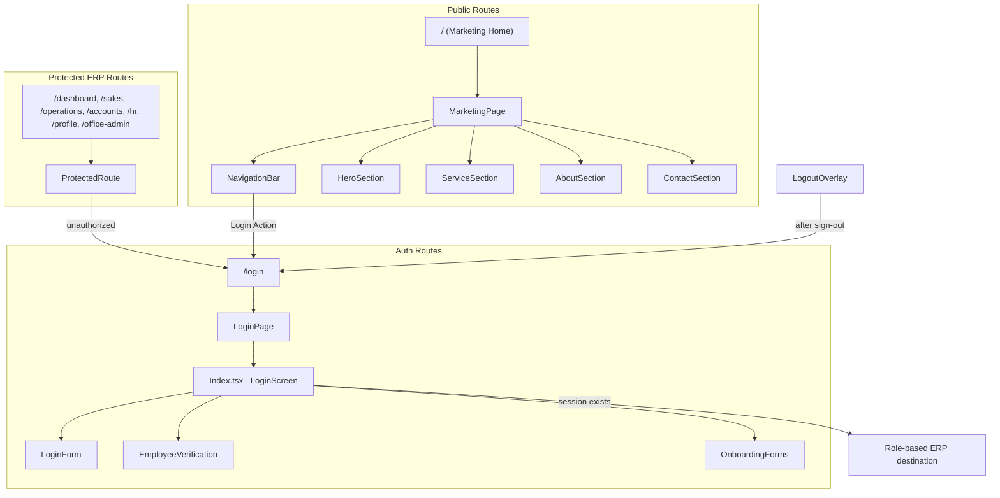

# Design Document: Marketing Website

## Overview

This design introduces a public marketing website at the application root (`/`) for Safend Secure Solutions, while relocating the existing ERP login to `/login`. The architecture leverages the existing Next.js 16 App Router, Tailwind CSS, Framer Motion, and Supabase authentication infrastructure. The marketing page is a static, publicly accessible page with no auth gating, containing sections that showcase Safend's security services, company information, and a contact/enquiry form. All existing auth redirects (logout, protected routes, session redirect) are updated to target `/login` instead of `/`.

### Key Design Decisions

1. **Route group separation**: Use Next.js route groups to cleanly separate the public marketing site layout from the ERP authenticated layout — no shared providers (React Query, BranchContext, etc.) are loaded on the marketing page.
2. **Static rendering**: The marketing home page uses Next.js static rendering (no `'use client'` at page level) for fast load times, with client islands only for the enquiry form and mobile nav toggle.
3. **Minimal dependency**: The marketing page uses only Tailwind CSS and Framer Motion (already installed) for styling and animation. No additional dependencies are introduced.
4. **Login relocation**: The existing `Index.tsx` module (containing LoginForm, employee verification, onboarding) moves unchanged to `/login` route. All redirect targets (`ProtectedRoute`, `LogoutOverlay`, `Index.tsx` session redirect) update from `'/'` to `'/login'`.

## Architecture



### Route Structure (Next.js App Router)

```
app/
├── (marketing)/           # Route group — public marketing layout
│   ├── layout.tsx         # Minimal layout (no ERP providers)
│   └── page.tsx           # Marketing home page at /
├── (erp)/                 # Route group — ERP layout with providers
│   ├── layout.tsx         # ERP layout (existing providers.tsx content)
│   ├── login/
│   │   └── page.tsx       # Relocated login screen
│   ├── dashboard/
│   │   └── page.tsx
│   ├── sales/
│   │   └── page.tsx
│   ... (other ERP routes)
├── layout.tsx             # Root layout (html/body, minimal)
└── not-found.tsx
```

**Rationale**: Route groups allow different layouts for marketing vs. ERP without affecting URL paths. The marketing page gets a lightweight layout (no React Query, no BranchContext, no Firebase), resulting in a smaller JS bundle and faster load for public visitors.

## Components and Interfaces

### New Components

| Component | Location | Responsibility |
|-----------|----------|---------------|
| `MarketingPage` | `app/(marketing)/page.tsx` | Server component assembling all marketing sections |
| `NavigationBar` | `src/components/marketing/NavigationBar.tsx` | Sticky header with logo, section links, Login button |
| `MobileNavMenu` | `src/components/marketing/MobileNavMenu.tsx` | Mobile hamburger menu (client component) |
| `HeroSection` | `src/components/marketing/HeroSection.tsx` | Brand hero with logo and tagline |
| `ServiceSection` | `src/components/marketing/ServiceSection.tsx` | Grid of security service offerings |
| `AboutSection` | `src/components/marketing/AboutSection.tsx` | Company background and value proposition |
| `ContactSection` | `src/components/marketing/ContactSection.tsx` | Contact info + enquiry form (client component) |
| `EnquiryForm` | `src/components/marketing/EnquiryForm.tsx` | Form with validation logic (client component) |

### Modified Components

| Component | Change |
|-----------|--------|
| `ProtectedRoute.tsx` | Update redirect from `'/'` to `'/login'` |
| `LogoutOverlay.tsx` | Update `window.location.href` from `'/'` to `'/login'` |
| `app/page.tsx` | Replaced by marketing page (login moves to `/login`) |
| `app/layout.tsx` | Simplified to bare html/body wrapper |
| `app/providers.tsx` | Moved into `app/(erp)/layout.tsx` |

### Interfaces

```typescript
// src/types/marketing.ts

export interface ServiceEntry {
  id: string;
  name: string;        // 1-60 characters
  description: string; // 1-500 characters
  icon?: string;       // Optional Lucide icon name
}

export interface EnquiryFormData {
  name: string;           // 1-100 characters
  contactMethod: string;  // Valid email or phone number
  message: string;        // 1-2000 characters
}

export interface EnquiryFormState {
  data: EnquiryFormData;
  errors: Record<keyof EnquiryFormData, string | null>;
  status: 'idle' | 'submitting' | 'success' | 'error';
}

export interface ContactInfo {
  phone: string;
  email: string;
  address: string;
}
```

### Navigation Bar Props

```typescript
interface NavigationBarProps {
  sections: Array<{
    id: string;    // Matches section element ID
    label: string; // Display text
  }>;
}
```

### Redirect Utility

```typescript
// src/utils/roleRedirect.ts

/**
 * Returns the ERP destination path for a given user role.
 * Unknown or null roles default to '/sales'.
 */
export function getRedirectPath(role: string | null): string;

/**
 * Set of protected ERP routes and their allowed roles.
 */
export const PROTECTED_ROUTES: Record<string, string[]>;

/**
 * Determines if a user with the given role is authorized for a route.
 */
export function isAuthorizedForRoute(role: string | null, route: string): boolean;
```

## Data Models

### Service Data (Static Configuration)

Services are defined as a static array in a config file — no database table needed since these are company-wide offerings that change rarely.

```typescript
// src/data/services.ts

import { ServiceEntry } from '@/types/marketing';

export const SERVICES: ServiceEntry[] = [
  {
    id: 'security-guards',
    name: 'Security Guards',
    description: 'Professional security personnel for businesses, residences, and commercial properties. Trained in surveillance, access control, and emergency response.',
    icon: 'Shield',
  },
  {
    id: 'housekeeping',
    name: 'Housekeeping Staff',
    description: 'Reliable housekeeping professionals for corporate offices, residential complexes, and hospitality venues. Vetted and trained to Safend standards.',
    icon: 'Home',
  },
  {
    id: 'bouncers',
    name: 'Bouncers',
    description: 'Experienced crowd management specialists for events, nightlife venues, and private functions. Skilled in de-escalation and access control.',
    icon: 'Users',
  },
  {
    id: 'armed-security',
    name: 'Armed Security Personnel',
    description: 'Licensed armed security officers for high-risk environments, VIP protection, cash-in-transit, and sensitive installations.',
    icon: 'ShieldAlert',
  },
];
```

### Contact Information (Static Configuration)

```typescript
// src/data/contact.ts

import { ContactInfo } from '@/types/marketing';

export const CONTACT_INFO: ContactInfo = {
  phone: '+91-XXXX-XXXXXX',   // To be provided by client
  email: 'info@safends.com',
  address: '...',              // To be provided by client
};
```

### Enquiry Submission

Enquiries are submitted via a Next.js API route (`/api/enquiry`) which inserts into a `marketing_enquiries` table in Supabase (using the service role key server-side).

```sql
-- Table: marketing_enquiries
CREATE TABLE IF NOT EXISTS marketing_enquiries (
  id UUID PRIMARY KEY DEFAULT gen_random_uuid(),
  name VARCHAR(100) NOT NULL,
  contact_method VARCHAR(255) NOT NULL,
  message TEXT NOT NULL CHECK (char_length(message) <= 2000),
  created_at TIMESTAMPTZ DEFAULT now(),
  status VARCHAR(20) DEFAULT 'new'
);
```

### Enquiry Validation Schema (Zod)

```typescript
// src/lib/enquirySchema.ts

import { z } from 'zod';

const phoneRegex = /^\+?[\d\s\-()]{7,20}$/;
const emailRegex = /^[^\s@]+@[^\s@]+\.[^\s@]+$/;

export const enquirySchema = z.object({
  name: z.string()
    .min(1, 'Name is required')
    .max(100, 'Name must be 100 characters or fewer'),
  contactMethod: z.string()
    .min(1, 'Contact method is required')
    .refine(
      (val) => emailRegex.test(val) || phoneRegex.test(val),
      'Must be a valid email address or phone number'
    ),
  message: z.string()
    .min(1, 'Message is required')
    .max(2000, 'Message must be 2000 characters or fewer'),
});

export type EnquiryInput = z.infer<typeof enquirySchema>;
```

### Role Redirect Mapping

```typescript
// src/utils/roleRedirect.ts

const ROLE_DESTINATIONS: Record<string, string> = {
  admin: '/dashboard',
  branch_admin: '/dashboard',
  sales: '/sales',
  operations: '/operations',
  accounts: '/accounts',
  hr: '/hr',
};

const DEFAULT_DESTINATION = '/sales';

export function getRedirectPath(role: string | null): string {
  if (!role) return DEFAULT_DESTINATION;
  return ROLE_DESTINATIONS[role] ?? DEFAULT_DESTINATION;
}

export const PROTECTED_ROUTES: Record<string, string[]> = {
  '/dashboard': ['admin', 'branch_admin'],
  '/sales': ['sales'],
  '/operations': ['operations'],
  '/accounts': ['accounts'],
  '/hr': ['hr'],
  '/profile': ['admin', 'branch_admin', 'sales', 'operations', 'accounts', 'hr'],
  '/office-admin': ['admin', 'branch_admin'],
};

export function isAuthorizedForRoute(role: string | null, route: string): boolean {
  if (role === 'admin') return true;
  const allowedRoles = PROTECTED_ROUTES[route];
  if (!allowedRoles) return false;
  return role !== null && allowedRoles.includes(role);
}
```

## Correctness Properties

*A property is a characteristic or behavior that should hold true across all valid executions of a system — essentially, a formal statement about what the system should do. Properties serve as the bridge between human-readable specifications and machine-verifiable correctness guarantees.*

### Property 1: Valid service entries are displayed completely

*For any* service entry with a non-empty name of 1–60 characters and a non-empty description of 1–500 characters, the Service Section rendering function SHALL include both the name and description in its output.

**Validates: Requirements 2.2, 2.3**

### Property 2: Invalid service entries are filtered out

*For any* array of service entries where some entries have an empty or missing name or an empty or missing description, the Service Section SHALL render only those entries with both a valid name (1–60 chars) and valid description (1–500 chars), omitting all others.

**Validates: Requirements 2.5**

### Property 3: Role-based redirect destination mapping

*For any* role string, the `getRedirectPath` function SHALL return `/dashboard` for "admin" and "branch_admin", the corresponding module path for "sales", "operations", "accounts", and "hr", and `/sales` for any other string value or null.

**Validates: Requirements 6.1, 6.2, 6.3, 6.4, 6.5, 6.6, 6.7**

### Property 4: Unauthorized access to protected routes redirects to login

*For any* protected route and *for any* user role that is NOT in that route's allowed-roles set and is NOT equal to "admin", the authorization check SHALL deny access (returning false), resulting in a redirect to `/login`.

**Validates: Requirements 8.1, 8.2**

### Property 5: Enquiry form validation rejects invalid input

*For any* enquiry form submission where the name is empty or exceeds 100 characters, or the message is empty or exceeds 2000 characters, or the contact method does not match a valid email or phone format, the validation function SHALL reject the submission and identify each invalid field.

**Validates: Requirements 9.4, 9.5**

## Error Handling

| Scenario | Behavior |
|----------|----------|
| Navigation to `/login` fails (Login_Action) | Keep visitor on marketing page, show toast/error indication |
| Session verification fails on `/login` | Keep user on Login_Screen, show error message |
| Session verification timeout (5s) on protected routes | Treat as unauthenticated, redirect to `/login` |
| Logout cleanup failure | Still redirect to `/login` (never leave user on current page) |
| Enquiry form submission delivery failure | Show error message, retain form values |
| Section scroll target not found | No-op — scroll position unchanged |
| Service data missing name/description | Omit that service entry silently |

### Error Display Patterns

- **Marketing page errors** (enquiry form, navigation): Inline error messages within the relevant section using Tailwind-styled alert blocks consistent with the marketing design.
- **ERP auth errors** (session check, logout): Use existing toast/overlay patterns from the ERP application.
- **Network failures**: Show user-friendly messages without exposing technical details.

## Testing Strategy

### Property-Based Tests (fast-check + vitest)

The project already has `fast-check` (v3.22.0) and `vitest` (v2.1.8) installed. Property-based tests will validate the five correctness properties defined above.

**Configuration**:
- Minimum 100 iterations per property test
- Each test tagged with: `Feature: marketing-website, Property {N}: {title}`
- Test file: `src/__tests__/marketing-website.property.test.ts`

**Properties to test**:
1. Service entry display validation — generate random `ServiceEntry` arrays, verify filtering/display logic
2. Invalid service entry filtering — generate entries with missing/invalid fields, verify omission
3. Role redirect mapping — generate random role strings, verify correct destination
4. Protected route authorization — generate random route+role combinations, verify access decision
5. Enquiry form validation — generate random form inputs (valid and invalid), verify schema rejects correctly

### Unit Tests (vitest)

- `NavigationBar` renders all required elements (logo, links, Login button)
- `HeroSection` renders logo and brand color
- `ServiceSection` renders exactly 4 services with correct content
- `ContactSection` renders contact info (phone, email, address)
- `EnquiryForm` shows confirmation on valid submission
- `EnquiryForm` retains values on delivery failure
- Login route renders `Index.tsx` (LoginScreen) correctly
- `LogoutOverlay` redirects to `/login` (not `/`)
- `ProtectedRoute` redirects to `/login` (not `/`)

### Integration / E2E Tests

- Root route (`/`) renders marketing page without auth prompt
- Login route (`/login`) renders login screen
- Authenticated user on `/login` redirects to role-appropriate destination
- Navigation links scroll to correct sections
- Mobile viewport: Login button visible, single-column layout, no horizontal scroll
- Enquiry form end-to-end submission (with mocked API)

### Smoke Tests

- Marketing page loads within 3 seconds (Lighthouse or similar)
- All section IDs exist in rendered DOM
- Brand color `#D71920` applied to at least one element
