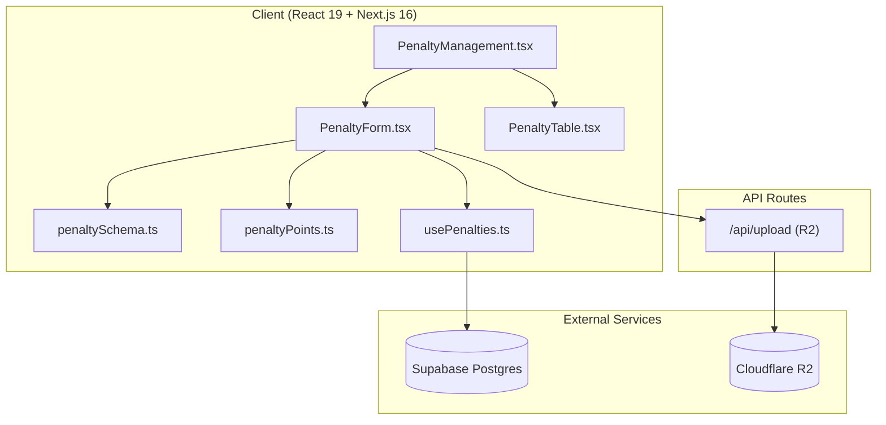
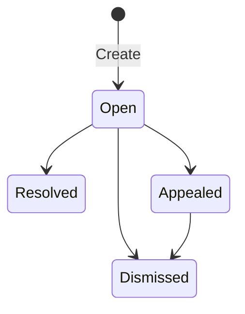

# Design Document: Penalty Management System

## Overview

This design describes the refactoring and enhancement of the existing Penalty Management module to support structured offense categorization (Disciplinary, Integrity, Criminal), dependent dropdown selection for specific offenses, auto-assigned offense weights, evidence file uploads to Cloudflare R2, and a "Source of Information" field tracking how violations were reported.

The system is an update to existing code within `src/modules/operations/`. The primary changes involve:
- Replacing the flat `violation_type` field with a two-level `offense_type` → `offense` hierarchy
- Replacing `points` with `weight` (same 1–5 range, different semantics)
- Adding `source_of_information` and `evidence_url` fields
- Updating the database schema, Zod validation, form component, and utility functions

## Architecture

The architecture remains a client-side React application backed by Supabase (Postgres + RLS) with file storage on Cloudflare R2. No new services are introduced.



### Key Design Decisions

1. **Two-level offense selection**: Offense type drives the available offenses via a static mapping in `penaltyPoints.ts`. No database lookup needed since offense lists are small and fixed.
2. **Weight auto-assignment with override**: Each offense has a default weight. Unlike the current system where only "Other" allows override, the new system always allows manual override of weight (1–5).
3. **Evidence upload reuses existing `/api/upload` route**: The route already handles R2 uploads with type/size validation. We pass `folder: 'penalties'` to namespace penalty evidence files.
4. **Database migration approach**: A new SQL migration script alters the existing `penalties` table, adding/renaming columns and updating constraints.

## Components and Interfaces

### Modified Files

| File | Changes |
|------|---------|
| `src/modules/operations/schemas/penaltySchema.ts` | Replace `VIOLATION_TYPES` with `OFFENSE_TYPES`, `OFFENSES_BY_TYPE`, `SOURCE_OF_INFORMATION`. Update Zod schema fields. |
| `src/modules/operations/utils/penaltyPoints.ts` | Replace violation-to-points map with offense-to-weight map. Remove `isPointsOverrideAllowed`. Add `getDefaultWeight(offense)`. |
| `src/modules/operations/components/PenaltyForm.tsx` | Add source of information dropdown, offense type/offense dependent dropdowns, weight field (always editable), evidence upload input. |
| `src/modules/operations/components/PenaltyTable.tsx` | Update columns to display Source, Offense Type, Offense, Weight. |
| `src/modules/operations/hooks/usePenalties.ts` | Update `PenaltyFormData` usage to match new schema fields. |
| `src/modules/operations/utils/penaltyFiltering.ts` | Update `searchPenalties` to match against `offense` and `offense_type` instead of `violation_type`. |
| `scripts/create_penalties_table.sql` | New migration script to alter the table schema. |

### New Files

| File | Purpose |
|------|---------|
| `scripts/alter_penalties_table_v2.sql` | Migration script adding new columns and constraints |

### Interface: penaltySchema.ts (Updated)

```typescript
// Source of information options
export const SOURCES_OF_INFORMATION = ['Patrol', 'Supervisor Call', 'Client Information'] as const;
export type SourceOfInformation = (typeof SOURCES_OF_INFORMATION)[number];

// Offense type categories
export const OFFENSE_TYPES = ['Disciplinary', 'Integrity', 'Criminal'] as const;
export type OffenseType = (typeof OFFENSE_TYPES)[number];

// Offenses grouped by type
export const OFFENSES_BY_TYPE: Record<OffenseType, readonly string[]> = {
  Disciplinary: ['Late Arrival', 'Early Left Duty Without Handover', 'Misbehave with Staff or Client'],
  Integrity: ['Sleeping on Duty', 'Mobile Use', 'Alcohol or Ganja on Duty', 'Leaking Sensitive Information', 'Bribery'],
  Criminal: ['Assault', 'Harassment', 'Drug Use', 'Vandalism', 'Theft'],
} as const;

// All possible offenses (flat list for type safety)
export type Offense = typeof OFFENSES_BY_TYPE[OffenseType][number];

// Zod schema for form validation
export const penaltyFormSchema = z.object({
  staff_id: z.string().uuid('Staff member is required'),
  staff_name: z.string().min(1, 'Staff member is required'),
  post_id: z.string().uuid('Post location is required'),
  post_name: z.string().min(1, 'Post location is required'),
  violation_date: z.string().refine(
    (val) => {
      const date = new Date(val);
      const today = new Date();
      today.setHours(23, 59, 59, 999);
      return !isNaN(date.getTime()) && date <= today;
    },
    { message: 'Violation date cannot be in the future' }
  ),
  source_of_information: z.enum(SOURCES_OF_INFORMATION, {
    required_error: 'Source of information is required',
  }),
  offense_type: z.enum(OFFENSE_TYPES, {
    required_error: 'Type of offense is required',
  }),
  offense: z.string().min(1, 'Offense selection is required'),
  weight: z.number().int().min(1, 'Weight must be at least 1').max(5, 'Weight must be at most 5'),
  description: z.string().min(1, 'Description is required'),
  evidence_url: z.string().url().nullable().optional(),
  related_entity_id: z.string().uuid().nullable().optional(),
  related_entity_type: z.string().nullable().optional(),
});
```

### Interface: penaltyPoints.ts (Updated)

```typescript
export const OFFENSE_WEIGHTS: Record<string, number> = {
  // Disciplinary (lower severity)
  'Late Arrival': 1,
  'Early Left Duty Without Handover': 2,
  'Misbehave with Staff or Client': 2,
  // Integrity (medium severity)
  'Sleeping on Duty': 3,
  'Mobile Use': 2,
  'Alcohol or Ganja on Duty': 4,
  'Leaking Sensitive Information': 4,
  'Bribery': 5,
  // Criminal (high severity)
  'Assault': 5,
  'Harassment': 4,
  'Drug Use': 4,
  'Vandalism': 3,
  'Theft': 5,
};

export function getDefaultWeight(offense: string): number {
  return OFFENSE_WEIGHTS[offense] ?? 1;
}
```

### Interface: PenaltyForm Props (Unchanged)

```typescript
interface PenaltyFormProps {
  isOpen: boolean;
  onClose: () => void;
  onSubmit: (data: PenaltyFormData) => void;
  editData: any | null;
}
```

### Evidence Upload Flow

1. User selects a file in the form
2. Client validates file type (image/audio/video/PDF) and size (≤20MB)
3. On form submit, file is uploaded to `/api/upload` with `folder: 'penalties'`
4. Response URL is stored in `evidence_url` field of the penalty record
5. If upload fails, form submission is blocked with error message

## Data Models

### Database Schema: `penalties` table (Updated)

```sql
ALTER TABLE penalties
  ADD COLUMN IF NOT EXISTS source_of_information TEXT,
  ADD COLUMN IF NOT EXISTS offense_type TEXT,
  ADD COLUMN IF NOT EXISTS offense TEXT,
  ADD COLUMN IF NOT EXISTS weight INTEGER,
  ADD COLUMN IF NOT EXISTS evidence_url TEXT;

-- Migrate existing data
UPDATE penalties SET
  source_of_information = 'Supervisor Call',
  offense_type = 'Disciplinary',
  offense = violation_type,
  weight = points
WHERE source_of_information IS NULL;

-- Drop old columns
ALTER TABLE penalties DROP COLUMN IF EXISTS violation_type;
ALTER TABLE penalties DROP COLUMN IF EXISTS points;

-- Add constraints
ALTER TABLE penalties
  ALTER COLUMN source_of_information SET NOT NULL,
  ALTER COLUMN offense_type SET NOT NULL,
  ALTER COLUMN offense SET NOT NULL,
  ALTER COLUMN weight SET NOT NULL;

ALTER TABLE penalties ADD CONSTRAINT chk_source_of_information
  CHECK (source_of_information IN ('Patrol', 'Supervisor Call', 'Client Information'));

ALTER TABLE penalties ADD CONSTRAINT chk_offense_type
  CHECK (offense_type IN ('Disciplinary', 'Integrity', 'Criminal'));

ALTER TABLE penalties ADD CONSTRAINT chk_weight
  CHECK (weight >= 1 AND weight <= 5);
```

### TypeScript Types

```typescript
// Database record shape
export interface PenaltyRecord {
  id: string;
  staff_id: string;
  staff_name: string;
  post_id: string;
  post_name: string;
  violation_date: string;
  source_of_information: SourceOfInformation;
  offense_type: OffenseType;
  offense: string;
  weight: number;
  description: string;
  evidence_url: string | null;
  status: PenaltyStatus;
  related_entity_id: string | null;
  related_entity_type: string | null;
  created_at: string;
  updated_at: string;
}
```

### Status Transition Model



Valid transitions are enforced in the UI by conditionally showing action buttons.

## Correctness Properties

*A property is a characteristic or behavior that should hold true across all valid executions of a system—essentially, a formal statement about what the system should do. Properties serve as the bridge between human-readable specifications and machine-verifiable correctness guarantees.*

### Property 1: Dependent dropdown returns only offenses for the selected type

*For any* offense type in the set {Disciplinary, Integrity, Criminal}, the offenses returned by `OFFENSES_BY_TYPE[offenseType]` SHALL all belong exclusively to that offense type category and no other.

**Validates: Requirements 2.3, 3.2, 3.3, 3.4**

### Property 2: Auto-assigned weight matches predefined mapping

*For any* offense in the complete offense list (all offenses across all types), `getDefaultWeight(offense)` SHALL return an integer between 1 and 5 inclusive that equals the predefined weight for that offense.

**Validates: Requirements 4.2**

### Property 3: Weight validation rejects out-of-range values

*For any* integer value less than 1 or greater than 5, the Zod schema validation for the `weight` field SHALL reject the value and produce a validation error.

**Validates: Requirements 4.4**

### Property 4: Evidence file validation accepts valid types and rejects invalid types and oversized files

*For any* file with a MIME type in the allowed set (image/jpeg, image/png, image/gif, image/webp, audio/mpeg, audio/wav, audio/ogg, video/mp4, video/webm, application/pdf) and size ≤ 20MB, the evidence validation function SHALL accept the file. *For any* file with a MIME type outside the allowed set OR size exceeding 20MB, the validation function SHALL reject the file.

**Validates: Requirements 5.2, 5.3, 5.4**

### Property 5: Future date validation

*For any* date string representing a date after today, the Zod schema validation for `violation_date` SHALL reject the value and produce a validation error.

**Validates: Requirements 9.2**

### Property 6: Status transition actions match valid transitions

*For any* penalty status, the set of allowed action buttons (resolve, appeal, dismiss) SHALL exactly equal the valid transitions defined in the status workflow: Open → {Resolved, Appealed, Dismissed}, Appealed → {Dismissed}, Resolved → {}, Dismissed → {}.

**Validates: Requirements 10.2, 10.3, 10.4, 10.5, 10.6**

### Property 7: Patrol source filter returns only patrol-sourced records

*For any* list of penalty records with mixed `source_of_information` values, filtering by the "Related Patrols" view SHALL return only records where `source_of_information` equals "Patrol" and SHALL include all such records from the original list.

**Validates: Requirements 11.1, 11.2**

### Property 8: Search filter matches only specified fields

*For any* non-empty search term and list of penalty records, the search filter function SHALL return only records where `staff_name`, `post_name`, `offense`, or `description` contains the search term (case-insensitive), and SHALL include all such matching records.

**Validates: Requirements 14.4**

## Error Handling

| Scenario | Handling |
|----------|----------|
| Staff members fetch fails | Show error alert in form, disable staff dropdown |
| Operational posts fetch fails | Show error alert in form, disable post dropdown |
| File upload exceeds 20MB | Client-side rejection with error message before upload attempt |
| File has unsupported type | Client-side rejection with error message before upload attempt |
| R2 upload fails | Show error toast, keep form open, allow retry |
| Supabase insert/update fails | Show error toast with reason, keep form open |
| Supabase delete fails | Show error toast with reason |
| Zod validation fails | Display field-specific validation errors, prevent submission |
| Network timeout on data fetch | React Query retry (3 attempts), then show error state |

## Testing Strategy

### Property-Based Tests (fast-check)

The project already includes `fast-check` (v3.22.0). Each correctness property above will be implemented as a property-based test with minimum 100 iterations.

**Test file:** `src/modules/operations/__tests__/penalty.property.test.ts`

Configuration:
- Library: `fast-check` (already available in project)
- Minimum iterations: 100 per property
- Tag format: `Feature: penalty-management-system, Property {N}: {title}`

Properties to test:
1. Dependent dropdown mapping correctness
2. Default weight assignment correctness
3. Weight out-of-range rejection
4. Evidence file type/size validation
5. Future date rejection
6. Status transition action correctness
7. Patrol source filtering
8. Search term filtering

### Unit Tests (Example-Based)

**Test file:** `src/modules/operations/__tests__/penalty.unit.test.ts`

- Form renders all required fields (source, offense_type, offense, weight, evidence, description, staff, post, date)
- Offense dropdown shows exact values per type (3 specific examples)
- Weight auto-populates when offense is selected
- Offense resets to empty when offense_type changes
- Form pre-populates correctly in edit mode
- Success/error toast notifications display correctly
- Confirmation dialog appears on delete

### Integration Tests

**Test file:** `src/modules/operations/__tests__/penalty.integration.test.ts`

- Create penalty with all fields → verify Supabase insert called with correct payload
- Update penalty → verify Supabase update called
- Delete penalty → verify Supabase delete called
- Cache invalidation after create/update/delete
- Evidence upload flow (mock `/api/upload` response)
