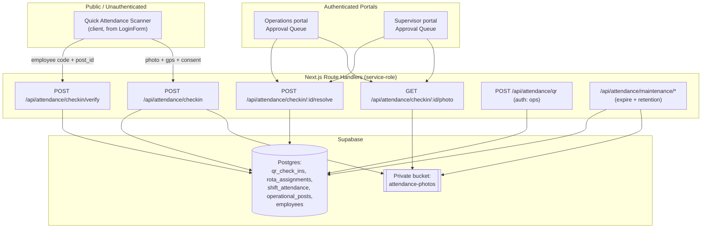
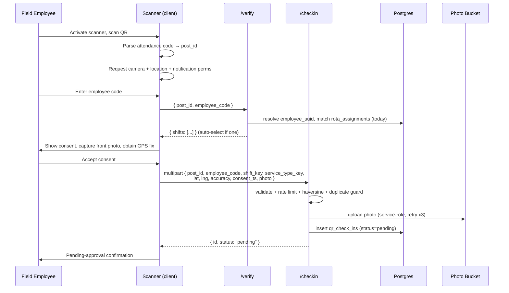
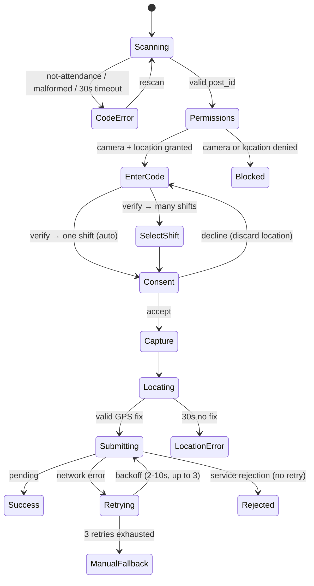

# Design Document

## Overview

The QR Field Attendance feature adds a public, QR-driven check-in flow to the Safend ERP so that field guards can mark attendance from the physical site without an account. The design keeps all trust-bearing decisions (deployment verification, geofence distance, duplicate prevention, storage access) on the server, exposed through unauthenticated Next.js Route Handlers that use the Supabase service-role key and the existing per-instance `rateLimit` limiter. The public client (the "Scanner") is a thin capture-and-submit UI: it reads a QR code, collects consent, a front-camera still, and a GPS fix, then posts everything to the server, which is the sole authority on whether a check-in is created.

Approved evidence flows into the existing operational data model. A new `qr_check_ins` table holds the pending → approved/rejected/expired lifecycle; on approval the server marks the matching `shift_attendance` slot `present`. The pending queue surfaces in both the Supervisor portal and the Operations portal, and either an Operations-role or Supervisor-role user can resolve an item. Photos are treated as biometric-adjacent data: stored in a private Supabase Storage bucket, exposed only through short-lived signed URLs, and auto-deleted 30 days after resolution.

This design aligns with existing project conventions:

- **Route Handlers** under `app/api/**` follow the established service-role pattern seen in `app/api/verify-employee/route.ts`, `app/api/lead/route.ts`, and `app/api/enquiry/route.ts` (module-level `createClient(SUPABASE_URL, SUPABASE_SERVICE_ROLE_KEY, { auth: { persistSession: false } })`).
- **Rate limiting** reuses `src/lib/rateLimit.ts` (`rateLimit`, `getClientIp`) exactly as `app/api/enquiry/route.ts` does.
- **Validation** uses `zod`, consistent with `src/lib/leadSchema.ts` and `src/modules/operations/schemas/penaltySchema.ts`.
- **Portal UI** lives in `src/modules/operations` and `src/modules/supervisor-portal`, using `@tanstack/react-query` hooks (mirroring `useSupervisorData.ts`, `useOperationalPosts.ts`).
- **Pure domain logic** lives in small, dependency-free modules under `src/lib/attendance/**` so it can be unit- and property-tested with `vitest` + `fast-check` (the project's established stack; see `penaltyValidation.property.test.ts`).
- **QR generation** uses `qrcode.react` (already a dependency); maps use `leaflet`/`react-leaflet` (already dependencies).

### Research Notes

- **QR scanning library**: The project ships `qrcode.react` for *generation* but no scanning library. The design introduces a scanner built on the browser-native `BarcodeDetector` API where available, with a lazy-loaded JS fallback decoder for browsers lacking it (iOS Safari support for `BarcodeDetector` is inconsistent). The decode target is a pure function that takes decoded text and returns a parse result, so the scheme parser is testable independently of any library choice. Reference: [MDN BarcodeDetector](https://developer.mozilla.org/en-US/docs/Web/API/BarcodeDetector) (content rephrased for compliance).
- **Geolocation & camera**: Captured via the standard `navigator.geolocation.getCurrentPosition` (with `enableHighAccuracy: true`) and `navigator.mediaDevices.getUserMedia({ video: { facingMode: 'user' } })`. These are Web Platform APIs requiring a secure (HTTPS) context, which Vercel provides.
- **Haversine**: The requirement fixes the algorithm (great-circle, Earth radius 6,371,000 m, rounded to one decimal). This is a pure function and the core geofence property.
- **Concurrency / duplicate prevention**: Postgres partial unique index on `qr_check_ins` guarantees at most one live (pending/approved) record per `(employee_uuid, post_id, check_in_date, shift_key)`, so concurrent submissions resolve to exactly one winner at the database layer rather than in application code.
- **Retention / expiry**: Implemented as idempotent server jobs invoked by Vercel Cron hitting protected maintenance routes (`app/api/attendance/maintenance/*`), consistent with running periodic work in a serverless deployment.
- **Vercel Hobby plan constraints** (the deployment target): these shape the maintenance design and are treated as hard limits:
  - *Cron cadence*: Hobby cron jobs run **at most once per day**; any expression that would fire more than daily fails at deploy time. Both maintenance crons are therefore scheduled on a fixed once-daily expression (e.g. `expire` at `0 3 * * *`, `retention` at `0 4 * * *`). This still satisfies R15.2 ("at least once every 24 hours"). Trigger timing is only guaranteed **within the hour**, so no logic may depend on precise cron timing.
  - *Function duration*: Hobby functions default to **10s** and are configurable only **up to 60s**. Every attendance route that does non-trivial I/O declares `export const maxDuration = 60` (the check-in upload+insert route and both maintenance routes) so they do not silently inherit the 10s default.
  - *Bounded maintenance work*: because a single daily run has a 60s ceiling, the `expire` and `retention` jobs process a **bounded batch** per invocation (`MAINTENANCE_BATCH_LIMIT`, e.g. 200 records ordered oldest-first) rather than the full backlog. Idempotency plus per-record isolation means the next daily run continues where the previous left off; a large backlog drains over successive days without ever exceeding the duration cap.
  - *Cron invocation method*: Vercel Cron calls endpoints via **GET**, so the maintenance routes export a `GET` handler (the public check-in/verify routes remain `POST`). Each maintenance route is protected by verifying the `CRON_SECRET` bearer token Vercel sends in the `Authorization` header; requests without it return 401.
  - *Commercial-use caveat*: Vercel's Hobby tier is intended for non-commercial use. If this feature ships as part of the commercial ERP, a Pro plan (which also raises the function duration cap to 5 minutes and removes the once-daily cron limit) is the appropriate target and would let the batching/cadence constraints above be relaxed.

## Architecture

### System Context



### Trust Boundary

The Scanner is untrusted. It contributes only raw inputs: `post_id` (from the QR), `employee_code`, GPS coordinates + accuracy, a photo, and a consent timestamp. Every gate that determines whether attendance can be recorded is server-side:

| Decision | Where | Never trusted from client |
|---|---|---|
| Employee exists + deployed today | `verify` route (service-role query on `employees` + `rota_assignments`) | selected shift, "is deployed" flag |
| Distance to post / within geofence | `checkin` route (haversine recompute) | client-computed distance or within-geofence |
| Duplicate slot | `checkin` route + DB partial unique index | client "already submitted" state |
| Photo acceptability | `checkin` route (size + content-type) | client MIME label alone (re-checked server-side) |
| Approver authorization | `resolve` / `photo` routes (session role check) | client role claims |
| Rate budget | all public routes (`rateLimit`) | — |

### Request Flow (happy path)



### Directory Layout

```
app/api/attendance/
  checkin/verify/route.ts          # Requirement 3, 14
  checkin/route.ts                 # Requirement 5,6,7,8,12,13,14
  checkin/[id]/photo/route.ts      # Requirement 8 (signed URL, authorized)
  checkin/[id]/resolve/route.ts    # Requirement 11 (approve/reject)
  qr/route.ts                      # Requirement 16 (ops-authenticated)
  maintenance/expire/route.ts      # Requirement 15 (GET, cron, maxDuration=60)
  maintenance/retention/route.ts   # Requirement 9  (GET, cron, maxDuration=60)

src/lib/attendance/
  attendanceCode.ts                # parse/format the QR scheme (pure)
  geo.ts                           # haversine + geofence eval (pure)
  checkinSchema.ts                 # zod schemas for verify + checkin (pure)
  photoValidation.ts               # size + content-type rules (pure)
  retention.ts                     # retention-window elapsed calc (pure)
  lifecycle.ts                     # status transition rules (pure)
  clientId.ts                      # header → client id (wraps getClientIp)

src/services/supabase/
  QrCheckInService.ts              # DB access for check-ins (client-side, portals)

src/modules/shared/attendance/
  useApprovalQueue.ts              # react-query hook (both portals)
  ApprovalQueue.tsx                # shared queue UI
  CheckInCard.tsx                  # single record: photo, map, distance, flags

src/modules/operations/components/attendance/QrPostCodes.tsx  # Requirement 16 UI
src/components/attendance/QuickAttendanceScanner.tsx          # Requirement 1-5, 13 client
```

## Components and Interfaces

### 1. Attendance Code Scheme (`src/lib/attendance/attendanceCode.ts`)

Encodes/parses the QR payload. The scheme is a namespaced URI so unrelated QR codes are unambiguously rejected.

```ts
// Scheme: "safend-attendance:v1:<post_id>" where post_id is a UUID.
export const ATTENDANCE_SCHEME = 'safend-attendance';
export const ATTENDANCE_VERSION = 'v1';

export type ParseResult =
  | { kind: 'ok'; postId: string }
  | { kind: 'malformed' }        // right scheme, bad/missing post_id
  | { kind: 'not-attendance' };  // wrong scheme entirely

export function formatAttendanceCode(postId: string): string;
export function parseAttendanceCode(raw: string): ParseResult;
export function isUuid(value: string): boolean;
```

- `parseAttendanceCode` distinguishes the three requirement outcomes: valid `post_id` (R1.2), correct scheme but malformed id (R1.3), and wrong scheme (R1.4).
- `formatAttendanceCode(parseAttendanceCode(x).postId) === x` for any valid code — the round-trip that anchors QR generation (R16.1, R16.5).

### 2. Geo Module (`src/lib/attendance/geo.ts`)

```ts
export const EARTH_RADIUS_M = 6_371_000;
export const DEFAULT_GEOFENCE_RADIUS_M = 50;

export interface Coord { lat: number; lng: number; }

export function isValidLat(v: unknown): v is number;   // number, -90..90
export function isValidLng(v: unknown): v is number;   // number, -180..180

/** Great-circle distance in meters, rounded to 1 decimal (R6.1). */
export function haversineMeters(a: Coord, b: Coord): number;

/** Applicable radius: configured 1..10000 else default 50 (R6.3, R6.4). */
export function effectiveRadius(geofenceRadius?: number | null): number;

export interface GeofenceEval {
  distanceM: number;
  radiusM: number;
  withinGeofence: boolean;   // strictly-less-than (R6.5, R6.6)
  lowAccuracy: boolean;      // accuracy > radius, or accuracy missing/NaN (R6.8, R6.11)
}
export function evaluateGeofence(
  gps: Coord, post: Coord, accuracyM: number | null | undefined, geofenceRadius?: number | null
): GeofenceEval;
```

### 3. Verification Service — `POST /api/attendance/checkin/verify`

Server-side deployment lookup (R3). Rate-limited first (R14).

Request:
```jsonc
{ "post_id": "uuid", "employee_code": "EMP001" }
```
Behavior:
1. `rateLimit(\`att-verify:${getClientIp(req)}\`, { limit: 5, windowMs: 60_000 })` → 429 with `Retry-After` when limited (R14.1–14.3).
2. Validate `employee_code` (non-empty after trim, ≤ 50 chars) via zod → 400 before any lookup (R3.8).
3. Resolve `employee_uuid` from `employees.employee_id`; if none → `{ ok:false, reason:'employee_not_found' }` (R3.3, R3.5).
4. Query `rota_assignments` where `post_id`, `rota_date = today` (app time zone), `employee_id = employee_uuid`.
5. Zero matches → `{ ok:false, reason:'not_assigned' }` (R3.4). One match → `{ ok:true, shifts:[{shift_key, service_type_key}] }` (R3.6). Many → list of distinct shift keys, ≤ 3 (R3.7).
6. Any DB error → 500 `{ ok:false, reason:'service_error' }`, no shift returned (R3.9).

Response envelope:
```ts
type VerifyResponse =
  | { ok: true; shifts: { shiftKey: 'day'|'afternoon'|'night'; serviceTypeKey: string }[] }
  | { ok: false; reason: 'employee_not_found' | 'not_assigned' | 'validation' | 'service_error' | 'rate_limited' };
```

### 4. Check-In Service — `POST /api/attendance/checkin`

`multipart/form-data` (fields + `photo` file). Orchestrates validation, geofence, duplicate guard, storage, insert (R5–R8, R12–R14). Declares `export const maxDuration = 60` so the photo upload (≤10MB, up to 3 retries) plus insert is not cut off by the Hobby 10s default.

Ordered pipeline (fail-fast, no partial writes):
1. Rate limit (R14.1–14.3).
2. Parse multipart; zod-validate scalar fields; missing required field → 400 naming the field (R7.6).
3. Photo pre-store validation: `0 < size ≤ 10,485,760` bytes, content-type ∈ {`image/jpeg`,`image/png`} (R14.4, R14.5).
4. Coordinate validity (R5.2, R6.9); load post; validate post coords configured (R6.10).
5. `evaluateGeofence(...)` — compute distance, within-geofence, low-accuracy flags (R6.1–R6.8, R6.11). Out-of-geofence does **not** abort; it is persisted with `within_geofence=false` (R7.3).
6. Duplicate guard: reject if a live pending record or a `present` attendance slot already exists (R12.1, R12.2).
7. Upload photo to private bucket with up to 3 retries; total failure → 500, no record (R8.1, R8.2).
8. Insert `qr_check_ins` (`status='pending'`). Partial unique index makes concurrent inserts resolve to one winner; unique violation → duplicate response (R12.3).
9. Return `{ id, status:'pending' }` (R7.4). Any insert failure after upload → attempt orphan-photo cleanup, return 500 (R7.5).

Rejection envelope carries a machine `reason` so the Scanner can distinguish retryable (network) from terminal (rejection) failures (R13.4, R13.5):
```ts
type CheckInError =
  | 'validation' | 'invalid_location' | 'post_not_configured'
  | 'duplicate_pending' | 'already_present' | 'photo_invalid'
  | 'upload_failed' | 'insert_failed' | 'rate_limited';
```

### 5. Photo Access — `GET /api/attendance/checkin/[id]/photo`

Authenticated (portal session). Verifies the caller holds Operations or Supervisor role via `getServerUser` + `getServerRoles` (as in `app/api/employee-portal/create-employee/route.ts`); non-approvers → 403 with no URL (R8.5). Generates a signed URL with `expiresIn: 300` (R8.4). If the stored path is marked expired, returns 410 and never generates a URL (R9.5). Signed-URL failure → 502, no public fallback (R8.6).

### 6. Resolution — `POST /api/attendance/checkin/[id]/resolve`

Authenticated. Body: `{ action: 'approve' | 'reject', notes?: string }` (notes ≤ 500 chars, R11.3).

- Role must be Operations or Supervisor, else 403 (R11.5).
- Load record; if status ≠ `pending` → 409 "already resolved" (R11.4).
- **Approve** (R11.1, R11.2): set `status='approved'`, `approved_by`, `approved_at`. Then locate the single `shift_attendance` row by `(attendance_date, post_id, shift_key, service_type_key, employee_id)`; set `status='present'`, `marked_at`, `marked_by`. If zero or >1 match → do not mark, leave check-in `pending`, return error `attendance_slot_unresolved` (R11.6). This ordering (attendance-mark inside the same transaction as the status flip, with rollback on slot ambiguity) preserves R11.6.
- **Reject** (R11.3): set `status='rejected'`, `reviewed_by`, `reviewed_at`, `reviewer_notes`.

### 7. Approval Queue (shared) — `src/modules/shared/attendance/*`

A shared react-query hook + presentational components consumed by both `SupervisorAttendance` and the Operations attendance area, each applying its own branch/access scope (`applyBranchScope`, portal role gates). This satisfies dual-portal visibility (R10.1) without duplicating logic.

`useApprovalQueue(scope)` returns pending records with derived display fields; `CheckInCard` renders photo (via the photo route), a Leaflet map marker, computed distance, timestamp, employee id, post id (R10.2), an out-of-geofence badge when `within_geofence=false` (R10.3), a low-accuracy badge when flagged (R10.4), evidence placeholders on load failure (R10.5), and the queue shows an empty state when no in-scope pending records exist (R10.6).

### 8. Quick Attendance Scanner (client) — `src/components/attendance/QuickAttendanceScanner.tsx`

Wired to the existing `showQrScanner` button in `LoginForm.tsx` (currently a TODO). A step machine:



Client responsibilities map to R1, R2, R4, R5, R13. It never decides eligibility — it only gathers inputs and renders the server's verdict. The submission queue (R13.1–R13.4) retries only on network/timeout conditions and shows the fixed manual-fallback message after 3 failed retries; service rejections short-circuit to the returned reason (R13.5). The panel is responsive at ≤ 1024px with no horizontal scroll (R1.6).

### 9. QR Generation — `POST /api/attendance/qr` + `QrPostCodes.tsx`

Operations-authenticated. Validates the `post_id` exists in `operational_posts` (R16.2 → 404 "post not found"); returns the encoded content `formatAttendanceCode(post_id)`. The client renders it with `qrcode.react` into a printable view containing the QR image, post name, and post code, with a print control (R16.4). Generation failure surfaces an error and a retry, never a partial code (R16.3).

## Data Models

### New table: `qr_check_ins`

```sql
create table public.qr_check_ins (
  id                uuid primary key default gen_random_uuid(),
  post_id           uuid not null references public.operational_posts(id),
  employee_code     text not null,
  employee_uuid     uuid not null references public.employees(id),
  shift_key         text not null check (shift_key in ('day','afternoon','night')),
  service_type_key  text not null,
  check_in_date     date not null,                       -- app-timezone calendar date

  gps_lat           double precision not null check (gps_lat between -90 and 90),
  gps_lng           double precision not null check (gps_lng between -180 and 180),
  gps_accuracy_m    double precision check (gps_accuracy_m >= 0),
  distance_m        double precision not null check (distance_m >= 0),
  within_geofence   boolean not null,
  low_accuracy      boolean not null default false,

  photo_path        text,                                -- null once expired
  photo_expired     boolean not null default false,
  consent_accepted_at timestamptz not null,              -- ISO8601 UTC (R4.4)

  status            text not null default 'pending'
                    check (status in ('pending','approved','rejected','expired')),
  approved_by       uuid,
  approved_at       timestamptz,
  reviewed_by       uuid,
  reviewed_at       timestamptz,
  reviewer_notes    text check (reviewer_notes is null or char_length(reviewer_notes) <= 500),

  branch_id         uuid,                                -- for portal scoping
  created_at        timestamptz not null default now(),
  updated_at        timestamptz not null default now()
);

-- At most one LIVE record per slot (pending or approved). Enables concurrency-safe
-- duplicate prevention at the DB layer (R12.1, R12.3). rejected/expired are excluded
-- so a slot can be retried after rejection/expiry.
create unique index qr_check_ins_live_slot_uniq
  on public.qr_check_ins (employee_uuid, post_id, check_in_date, shift_key)
  where status in ('pending','approved');

create index qr_check_ins_status_idx on public.qr_check_ins (status, check_in_date);
create index qr_check_ins_post_idx   on public.qr_check_ins (post_id, check_in_date);
```

RLS: enabled; no anon policy (public routes use the service-role key, which bypasses RLS, exactly as existing public routes do). Portal reads go through authenticated BFF/service paths scoped by branch and role.

### New storage bucket: `attendance-photos`

- Private (no public read) — R8.3.
- Path convention: `attendance/{check_in_date}/{check_in_id}.{ext}`.
- Access only via server-generated signed URLs (`expiresIn = 300`) from the authorized photo route (R8.4).
- Objects deleted by the retention job 30 days after resolution (R9).

### Referenced existing tables (unchanged shape)

- `operational_posts` — `id uuid`, `location jsonb` (`{ latitude, longitude, geofenceRadius? }`), `post_name`, `post_code`, `status`, `branch_id`. Source of post coordinates and geofence radius (see `OperationalPostService.ts`).
- `rota_assignments` — `rota_date`, `post_id`, `shift_key`, `service_type_key`, `employee_id` (UUID), `employee_name`, `employee_code`. Deployment lookup source (R3).
- `shift_attendance` — `attendance_date`, `post_id`, `shift_key`, `service_type_key`, `slot_index`, `employee_id`, `status`, `marked_at`, `marked_by`. Marked `present` on approval (R11.2).
- `employees` — `id uuid`, `employee_id text` (the human code), `status`, `branch_id`. Employee-code resolution (R3.1, R3.3).

### Submission DTOs (zod, `checkinSchema.ts`)

```ts
export const verifyInput = z.object({
  post_id: z.string().uuid(),
  employee_code: z.string().trim().min(1).max(50),
});

export const checkInFields = z.object({
  post_id: z.string().uuid(),
  employee_code: z.string().trim().min(1).max(50),
  shift_key: z.enum(['day', 'afternoon', 'night']),
  service_type_key: z.string().min(1),
  gps_lat: z.coerce.number().gte(-90).lte(90),
  gps_lng: z.coerce.number().gte(-180).lte(180),
  gps_accuracy_m: z.coerce.number().gt(0),
  consent_accepted_at: z.string().datetime(), // ISO 8601 UTC
});
```

## Correctness Properties

*A property is a characteristic or behavior that should hold true across all valid executions of a system — essentially, a formal statement about what the system should do. Properties serve as the bridge between human-readable specifications and machine-verifiable correctness guarantees.*

The properties below target the pure, input-varying logic of this feature (the QR scheme parser, geo/geofence math, validation predicates, lifecycle transitions, duplicate/expiry decisions, retry policy, and rate-limit derivation). UI timing, permission prompts, storage wiring, and cross-portal latency are validated with example/integration/smoke tests instead (see Testing Strategy) and are intentionally not expressed as properties.

### Property 1: Attendance code round-trip and classification

*For any* valid `post_id` (UUID), parsing the code produced by `formatAttendanceCode(post_id)` returns `{ kind: 'ok', postId }` with `postId === post_id`, and repeated formatting of the same `post_id` always parses back to that same `post_id`. *For any* string carrying the attendance scheme prefix but a non-UUID payload, parsing returns `malformed`; *for any* string not carrying the attendance scheme prefix, parsing returns `not-attendance`.

**Validates: Requirements 1.2, 1.3, 1.4, 16.1, 16.5**

### Property 2: Shift resolution over matched deployments

*For any* set of matched deployments for an employee/post/today, the resolver returns exactly the distinct shift keys present (each ∈ {day, afternoon, night}, at most three), sets auto-select true when exactly one distinct shift exists, and requires an explicit selection when more than one exists.

**Validates: Requirements 3.6, 3.7**

### Property 3: Effective geofence radius selection

*For any* configured `geofenceRadius` in the inclusive range 1–10,000 meters, the effective radius equals that value; *for any* missing, null, or out-of-range `geofenceRadius`, the effective radius equals the default of 50 meters.

**Validates: Requirements 6.3, 6.4**

### Property 4: Haversine distance and geofence comparison

*For any* two coordinate pairs, the computed distance is non-negative, symmetric (distance(a,b) = distance(b,a)), equal to 0 when the points are identical, and rounded to one decimal place; and *for any* computed distance and applicable radius, the within-geofence flag is true if and only if the distance is strictly less than the radius.

**Validates: Requirements 6.1, 6.5, 6.6**

### Property 5: Low-accuracy flagging

*For any* reported GPS accuracy and applicable radius, the low-accuracy flag is true if and only if the accuracy is missing/non-numeric, or the accuracy is greater than the applicable radius.

**Validates: Requirements 6.8, 6.11**

### Property 6: Accepted submission produces a complete pending record

*For any* validated submission, whether the computed location is inside or outside the geofence, the constructed check-in record has status `pending`, carries all required fields non-null and within their range constraints (lat −90..90, lng −180..180, accuracy ≥ 0, distance ≥ 0, within-geofence boolean, photo path present), and the within-geofence flag equals the server-computed value (false when out of geofence).

**Validates: Requirements 7.2, 7.3**

### Property 7: Missing required field is rejected without a record

*For any* submission with any single required field omitted, server validation rejects the submission, names a missing field, and no check-in record is created.

**Validates: Requirements 7.6**

### Property 8: Approval queue view-model completeness and indicators

*For any* pending check-in record, the queue view-model includes a photo reference, the computed distance, the map location, the check-in timestamp, the employee identifier, and the post identifier; it sets the out-of-geofence indicator if and only if the record's within-geofence flag is false; and it sets the low-accuracy indicator if and only if the record's low-accuracy flag is true.

**Validates: Requirements 10.2, 10.3, 10.4**

### Property 9: At most one live record per slot

*For any* sequence (including concurrent arrivals) of check-in submissions sharing the same `(employee_uuid, post_id, check_in_date, shift_key)`, at most one live record (status `pending` or `approved`) exists afterward; every additional submission for a slot that already has a live record — or whose attendance slot is already `present` — is rejected and creates no new record and leaves the existing record unchanged.

**Validates: Requirements 12.1, 12.2, 12.3**

### Property 10: Check-in lifecycle transitions

*For any* record in status `pending`, applying approve yields status `approved` with the approver identifier and approval timestamp set; applying reject with notes of at most 500 characters yields status `rejected` with the reviewer identifier, review timestamp, and notes set (notes over 500 characters are rejected); and *for any* record already in status `approved`, `rejected`, or `expired`, any approve or reject action leaves the status unchanged and reports an "already resolved" error.

**Validates: Requirements 11.1, 11.3, 11.4**

### Property 11: Submission retry policy

*For any* sequence of submission attempts, the policy retries only when the failure is a network/timeout condition, performs at most 3 retries with each inter-attempt delay in the inclusive range 2–10 seconds, concludes with the manual-fallback outcome (not a pending confirmation) when all retryable attempts fail, and performs zero retries when the response is a service rejection (surfacing the rejection reason instead).

**Validates: Requirements 13.1, 13.4, 13.5**

### Property 12: Expiry selectivity

*For any* check-in record and any "current date", the record is selected for expiry if and only if its status is `pending` and its check-in date is earlier than the current date; applying an expiry transition changes only the record's status (to `expired`) and never modifies any `shift_attendance` row.

**Validates: Requirements 15.1, 15.5, 15.6**

### Property 13: Photo acceptability

*For any* photo size in bytes and content type, the photo is acceptable if and only if the size is greater than 0 and no more than 10,485,760 bytes and the content type is `image/jpeg` or `image/png`; an unacceptable photo causes the submission to be rejected with no photo stored and no record created.

**Validates: Requirements 14.4, 14.5**

### Property 14: Client identifier derivation precedence

*For any* combination of request headers, the derived client identifier is the first non-empty entry of the first present header in the order `x-forwarded-for` (first comma-separated entry), then `x-real-ip`, then `cf-connecting-ip`, and `"unknown"` when none are present.

**Validates: Requirements 14.1**

### Property 15: Attendance slot resolution on approval

*For any* set of `shift_attendance` rows matching `(attendance_date, post_id, shift_key, service_type_key, employee_uuid)`, approval marks attendance `present` if and only if exactly one row matches; when zero or more than one match, no attendance row is modified, the check-in remains `pending`, and an "attendance slot could not be resolved" error is returned.

**Validates: Requirements 11.6**

### Property 16: Client-side GPS submission gate

*For any* candidate GPS position, the Scanner enables submission if and only if the latitude is within −90..90, the longitude is within −180..180, and the reported horizontal accuracy is a number strictly greater than 0.

**Validates: Requirements 5.2**

### Property 17: Server-side coordinate rejection

*For any* submitted coordinates that are missing, non-numeric, or outside the valid ranges (−90..90 latitude, −180..180 longitude), the Check-In Service rejects the check-in with an invalid-location error and creates no record.

**Validates: Requirements 6.9**

### Property 18: Employee code validation

*For any* employee code that is empty, whitespace-only, or longer than 50 characters, the Verification Service rejects the request with a validation error before performing any lookup and returns no shift key.

**Validates: Requirements 3.8**

### Property 19: Rate-limit budget and Retry-After

*For any* burst of requests sharing a client identifier within a 60-second window, at most 5 are allowed and every subsequent request in that window is limited; *for any* limited request, the returned Retry-After is a whole number of seconds at least 1, and no deployment lookup or check-in insert is performed.

**Validates: Requirements 14.2, 14.3**

## Error Handling

The design uses a single principle: **the server never leaves a partial or inconsistent state, and the client always receives a machine-readable reason it can act on.**

### Server (Route Handlers)

- **Validation errors (400)** — zod parse failures return `{ ok:false, reason:'validation', field? }`. Applied before any I/O so no lookup, upload, or insert occurs (R3.8, R7.6, R6.9).
- **Rate limiting (429)** — `rateLimit` short-circuits before any work; response sets `Retry-After` (whole seconds, min 1) (R14.1–14.3).
- **Deployment/geofence rejections (200 with `ok:false`, or 409/422)** — `employee_not_found`, `not_assigned`, `invalid_location`, `post_not_configured`, `duplicate_pending`, `already_present`. These are terminal for the client and must not trigger client retries (R13.5).
- **Photo pipeline** — invalid photo → reject before upload (R14.5). Upload retried up to 3 times; total failure → `upload_failed` (500) and **no** DB insert, guaranteeing no record references an unstored photo (R8.2). If the insert fails *after* a successful upload, the handler deletes the just-uploaded object (best-effort orphan cleanup) and returns `insert_failed` (R7.5).
- **Duplicate race** — the DB partial unique index is the source of truth; a unique-violation on insert is mapped to `duplicate_pending` rather than a 500 (R12.3).
- **Approval integrity** — attendance marking and the status flip run in one transaction; if the attendance slot is ambiguous (0 or >1 match), the transaction rolls back, leaving the check-in `pending` and returning `attendance_slot_unresolved` (R11.6). Re-resolving an already-resolved record returns 409 `already_resolved` (R11.4).
- **AuthZ** — photo and resolve routes verify Operations/Supervisor role via the existing `getServerUser`/`getServerRoles` helpers; failures return 403 with no side effects and no signed URL (R8.5, R11.5).
- **Signed URL / storage read** — signing failures return 502 with no public fallback path (R8.6); expired photo paths return 410 (R9.5).
- **Maintenance jobs** — expiry and retention iterate record-by-record over a **bounded batch** (`MAINTENANCE_BATCH_LIMIT`, oldest-first) to stay within the Hobby 60s function ceiling; a failure on one record is logged and skipped, leaving that record in its prior state for the next cycle, and processing continues (R9.4, R15.7). Both jobs are idempotent (safe to re-run), so a backlog larger than one batch drains over successive daily runs. Both routes export `maxDuration = 60`, accept only `GET` (Vercel Cron), and reject callers lacking the `CRON_SECRET` bearer token with 401.

### Client (Scanner)

- **Code errors** — malformed vs non-attendance vs no-code-in-30s each show a distinct message and a rescan control (R1.3–R1.5).
- **Permission/fix errors** — camera or location denied, or no GPS fix in 30s, show a message and block submission while retaining entered data (R2.2, R2.3, R2.7, R5.3).
- **Network resilience** — timeouts/offline are queued and retried (2–10s backoff, ≤3 attempts); exhaustion shows only the fixed manual-fallback message (R13.1–R13.4). Service rejections are shown verbatim from the returned `reason` and never retried (R13.5).
- **Consent** — declining discards collected location data and returns to the pre-capture step (R4.5); camera failure at capture retains the consent timestamp and shows an error (R4.6).

## Testing Strategy

The project already standardizes on **Vitest** with **`fast-check`** for property tests (see `src/modules/operations/__tests__/penaltyValidation.property.test.ts`), so property-based testing IS appropriate here for the substantial pure-logic surface (parser, geo math, validation, lifecycle, duplicate/expiry decisions, retry policy, rate-limit derivation). UI, storage, and cross-service concerns use example/integration/smoke tests instead.

### Dual approach

- **Property tests** (`*.property.test.ts`): one property-based test per correctness property above, each running a minimum of 100 iterations, each tagged with a comment referencing its design property.
- **Unit/example tests**: concrete scenarios and error branches (unknown employee code, service errors, permission denials, consent decline, signed-URL success/expiry, empty-state queue).
- **Integration tests**: server-side deployment lookup against seeded rota rows, cross-portal visibility, photo upload/signing via a mocked service-role storage client, and the concurrency winner for Property 9 (exercising the real partial unique index).
- **Smoke/config checks**: bucket-is-private, cron scheduled once daily (Hobby-compatible, ≤ 24h cadence), maintenance routes reject missing `CRON_SECRET`, responsive layout at ≤1024px.

### Property test configuration

- Library: `fast-check` (already a dev dependency).
- Minimum **100 iterations** per property test (`{ numRuns: 100 }`), matching the existing convention.
- Each property test carries a tag comment in the form:
  `// Feature: qr-field-attendance, Property {number}: {property_text}`
- Each correctness property is implemented by a **single** property-based test.

### Property-to-module mapping

| Property | Module under test | Generators |
|---|---|---|
| 1 | `attendanceCode.ts` | UUIDs, scheme-prefixed non-UUID strings, arbitrary strings |
| 2 | shift resolver (in `verify` logic) | sets of deployments with varying shift keys |
| 3, 4, 5 | `geo.ts` | coordinate pairs, radii, accuracies (incl. missing/NaN) |
| 6, 7, 17, 18 | `checkinSchema.ts` + record builder | valid/invalid submissions, field-omission |
| 8 | queue view-model builder | generated `qr_check_ins` rows |
| 9, 15 | `lifecycle.ts` + duplicate model | submission multisets, slot-match sets |
| 10, 12 | `lifecycle.ts` | records in each status, dates around "today" |
| 11 | retry policy | failure sequences (network vs rejection) |
| 13 | `photoValidation.ts` | sizes (incl. 0 and >10MB), content types |
| 14, 19 | `clientId.ts`, `rateLimit.ts` | header combinations, request bursts, clock offsets |
| 16 | Scanner submission gate predicate | candidate positions |

### Example / integration coverage (non-PBT criteria)

Requirements classified as EXAMPLE/INTEGRATION/SMOKE in prework are covered as: scanner step-machine component tests (R1.1, R1.5, R1.6, R2.x, R4.x, R5.1, R5.3, R13.2, R13.3), verify/checkin route tests with seeded/mocked Supabase (R3.1–R3.5, R3.9, R3.10, R6.2, R6.7, R6.10, R7.1, R7.4, R7.5, R8.x), approval/portal tests (R10.1, R10.5, R10.6, R11.2, R11.5), retention/expiry job tests (R9.2–R9.4, R15.2–R15.4, R15.7), and QR generation UI/route tests (R16.2–R16.4).
