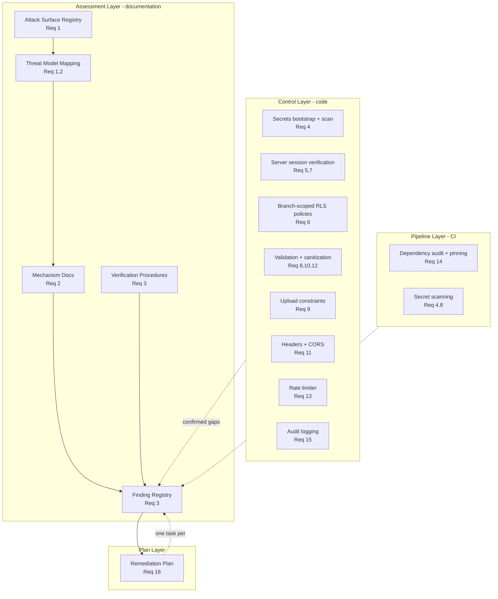

# Design Document

## Overview

This design delivers the two artifacts the requirements call for — a **Security Assessment** (threat model, mechanism documentation, ethical-hacking-style exploitability verification, severity ratings) and a **prioritized Remediation Plan** — for the Safend application (Next.js 16 App Router, React 19, Supabase Auth/Postgres/RLS, Firebase Firestore, Cloudflare R2 via the AWS S3 SDK, and a React-PDF quotation generator that also runs in a separate Express process under `server/`).

The work has a documentation deliverable and a code deliverable that are tightly coupled:

- **Documentation** (Requirements 1–3, 16, plus the assessment clauses of 4–15): a structured, version-controlled set of records — an attack-surface registry, a threat-model mapping, a finding registry with verification results and severities, and a single remediation plan. These are authored artifacts, not running code, and are validated by review and schema/lint checks rather than by property-based tests.
- **Code controls** (the target-state clauses of Requirements 4–15): server-side auth guards, RLS policy rewrites, input validation and sanitization, file-upload constraints, SSRF guards, security headers/CORS, PII allow-listing, rate limiting, dependency pinning, and audit logging. A meaningful subset of these are **pure functions** (sanitizers, validators, magic-byte checks, the rate limiter, allowlist matchers) that are excellent property-based-testing targets.

A key constraint from the requirements is that the prior `AUDIT_REPORT.md` (2025-08-12, 49 findings) is a *starting reference only*. Several of its HIGH findings have already been partially remediated in source (visible in `middleware.ts`, `app/api/upload/route.ts`, `app/api/admin/create-user/route.ts`, the rate-limited public routes, and the RLS scripts under `scripts/`). Therefore every candidate finding **must be re-verified against current code** and classified as `confirmed`, `not-exploitable`, `partially-mitigated`, or `unverified`, rather than assumed from the prior audit.

### Current-state observations (informing the design)

A scan of the current source shows the remediation baseline is already partly in place; the assessment must measure the *gap*, not restate the old audit:

- **Secrets**: server routes read `SUPABASE_SERVICE_ROLE_KEY`, R2 keys, and Supabase URL/anon key from `process.env` with no hardcoded literals (`app/api/**`, `src/config/firebase.ts`). `verify-employee`, `admin/create-user`, `lead`, and `enquiry` throw at module load if required vars are missing — but `app/api/upload/route.ts` and `src/integrations/supabase/client.ts` use silent fallbacks (`?? ''`, `'https://placeholder.supabase.co'`) instead of failing fast. This is a real gap against Requirement 4.3.
- **Auth/session**: `middleware.ts` deliberately does **not** enforce auth because Supabase sessions live in `localStorage` (not cookies); gating is client-side via `ProtectedRoute`. This is the central architectural weakness behind Requirements 5.1, 5.4, and 5.7.
- **Upload route**: already implements auth guard, folder allowlist, MIME allowlist, magic-byte checks, size caps, prefix sanitization, and `Content-Disposition: attachment` for inline-unsafe types — these need *verification* (Requirement 9), not necessarily rewriting.
- **Public routes**: `gst-lookup`, `pincode-lookup`, `lead`, `enquiry`, `quotation-pdf` already use the in-memory `rateLimit()` and input validation. The known limitation (per-process, not shared across instances) is exactly Requirement 13.4–13.5.
- **RLS**: `scripts/` contains both the regression (`fix_rls_security_regression.sql`, `branch_isolation_rls.sql`) and a history of permissive `USING (true)` / anon policies. The assessment must determine which policy set is actually live and enumerate tables referenced in code with no SQL definition (Requirements 6.1, 6.8).
- **Audit logging**: `src/utils/auditLog.ts` writes a sentinel `'client-side (see server logs for IP)'` for IP and defaults actor to `'Admin'`/`'admin@safend.com'` — placeholder values that Requirement 12.5 and 15.3 explicitly target.

### Scope boundary

PBT applies only to the **pure-function security controls**. The assessment artifacts, RLS policies (declarative SQL), security headers (middleware configuration), CI controls, and audit-log wiring are validated by review, integration tests, snapshot/schema checks, and smoke tests — not property tests. This split is made explicit in the Testing Strategy.

## Architecture

The deliverable is organized into four layers that map onto the requirement groups.



### Assessment methodology

The assessment is executed and recorded as structured markdown documents living under `.kiro/specs/security-hardening/assessment/` (authored during task execution, not part of this design):

1. **Enumerate** every attack surface by walking `app/api/**`, `server/routes/**` and `server/index.js`, the route groups under `app/(marketing)`, `app/(client-portal)`, `app/(employee-portal)`, `app/(erp)`, the public employee-verification flow (`app/api/verify-employee`, `src/components/EmployeeVerificationPage.tsx`), and the Supabase database interface. Each surface records its source path and exactly one exposure class (`publicly-exposed` | `authenticated-only`), defaulting to `publicly-exposed` + manual-review flag when undeterminable (Req 1.3, 1.7).
2. **Map** each surface to applicable threat categories and an assumed attacker capability (`unauthenticated-external` | `authenticated-low-privilege` | `cross-tenant-authenticated`) (Req 1.4, 1.5).
3. **Document mechanisms** per threat category — entry surface, attacker-controlled input, weakness, observable impact, preconditions — with no remediation language mixed in (Req 2).
4. **Verify** each candidate finding with a reproducible procedure run only against a non-production/controlled environment, recording `confirmed` | `not-exploitable` | `partially-mitigated` | `unverified`, re-checking each prior-audit finding as `still-applies` | `no-longer-applies` | `partially-applies`, and assigning a severity to each confirmed finding (Req 3).
5. **Plan** one remediation task per confirmed finding, ordered by descending severity with deterministic tie-breaking and recorded dependencies (Req 16).

### Remediation control architecture

The code controls follow a defense-in-depth layering:

- **Edge / middleware**: security headers + CSP for every response (`middleware.ts`); future server-side session verification once sessions move to cookies via `@supabase/ssr`.
- **Route handlers**: per-route auth guards, role checks, schema validation, sanitization, rate limiting — all derived from the *server-verified* session, never from client-supplied role data.
- **Pure-function utilities** (the PBT surface): `src/lib/security/` sanitizers and validators (search-term sanitizer, filename/prefix sanitizer, folder allowlist matcher, GSTIN/pincode validators, header-value sanitizer, magic-byte matcher, PII field projector) and `src/lib/rateLimit.ts`.
- **Database**: branch-scoped, role-aware RLS policies using non-recursive `SECURITY DEFINER` helper functions (`app_user_branch_uuid()`, `app_user_branch_code()`, `app_is_main_user()`).
- **Pipeline**: dependency audit + exact-version pinning and secret scanning as CI/pre-commit controls.

### Key architectural decision: consolidating the security controls

The current sanitizers and validators are inlined in individual route files (e.g. `sanitizeSearchTerm` in `verify-employee/route.ts`, `isAllowedFolder` and `contentMatchesDeclaredType` in `upload/route.ts`, `safeFilenamePart` in `quotation-pdf/route.ts`, `isValidGSTIN` in `gst-lookup/route.ts`). To make them independently testable as pure functions (the PBT target) and to guarantee consistent behavior system-wide, the design extracts them into a dedicated `src/lib/security/` module with no I/O dependencies. Route handlers import and call them. This is the single most important design change enabling property-based verification.

## Components and Interfaces

### 1. Assessment document set (authored artifacts)

Located under `.kiro/specs/security-hardening/assessment/`:

- `attack-surfaces.md` — the registry (Req 1).
- `threat-model.md` — categories, surface-to-category mapping, attacker capabilities (Req 1, 2).
- `mechanisms.md` — per-category exploitation mechanisms (Req 2).
- `findings.md` — the finding registry with verification results and severities (Req 3).
- `remediation-plan.md` — the single prioritized plan (Req 16).

These are validated structurally (every record has the required fields) rather than by unit tests.

### 2. `src/lib/security/` — pure security-control functions (PBT target)

```typescript
// search-sanitizer.ts
/** Remove PostgREST structural/wildcard chars, keep safe human-search set. (Req 8.2, 12.3) */
export function sanitizeSearchTerm(raw: string): string;

// path-sanitizer.ts
/** Replace every char outside [a-zA-Z0-9.-] with '_' for object-key prefixes/filenames. (Req 9.6) */
export function sanitizeKeySegment(value: string): string;
/** True iff folder has no traversal/absolute/backslash and matches an allowed prefix. (Req 9.5) */
export function isAllowedFolder(folder: string): boolean;

// header-sanitizer.ts
/** Strip control chars (<0x20) and path separators (/ \) for header values. (Req 8.5) */
export function sanitizeHeaderValue(value: string): string;

// lookups.ts
/** Validate the 15-char GSTIN format. (Req 10.1) */
export function isValidGSTIN(gstin: string): boolean;
/** Validate a 6-digit pincode. (Req 10.2) */
export function isValidPincode(pincode: string): boolean;

// content-type.ts
/** Best-effort magic-byte match for signature-checkable declared MIME types. (Req 9.3) */
export function contentMatchesDeclaredType(leadingBytes: Uint8Array, declaredType: string): boolean;
/** Resolve the size cap (bytes) for a declared MIME type's category. (Req 9.4) */
export function maxSizeForType(declaredType: string): number;
/** True iff the declared MIME type is in the allowed-types union. (Req 9.2) */
export function isAllowedType(declaredType: string): boolean;

// pii.ts
/** Project an employee record onto the verification-field allowlist only. (Req 12.2) */
export function projectVerificationFields(employee: Record<string, unknown>): VerificationResult;
```

These functions are deterministic, have no I/O, and replace the inline implementations in the route files.

### 3. Auth and authorization (server-side)

```typescript
// src/lib/auth/server-session.ts
/** Resolve the caller's verified Supabase user from bearer token or session cookie, or null. (Req 5.2, 9.1) */
export async function getServerUser(request: Request): Promise<AuthUser | null>;
/** Load the caller's server-verified ERP roles via service-role client. (Req 7.2) */
export async function getServerRoles(userId: string): Promise<string[]>;
/** True iff the caller holds a concrete ERP staff role. (Req 7.6) */
export function hasStaffRole(roles: string[]): boolean;
```

Route handlers return `401` when `getServerUser` yields null (Req 5.3, 9.1), `403` when the role check fails (Req 7.3, 7.7), and `400` when a requested role is outside the assignable allowlist (Req 7.5). Authorization is derived solely from the server-verified session, never from the request body/headers/query (Req 7.4).

The longer-term session strategy (Req 5.4) is to migrate browser session storage from `localStorage` to cookies using `@supabase/ssr`, enabling `middleware.ts` to verify sessions at the edge and `ProtectedRoute` to re-validate server-side on each evaluation (Req 5.7). The mock admin user path in `AppDataContext` is already neutralized (`user: null`); Requirement 5.6 is verified, not re-implemented, and Req 5.8 mandates no default/hardcoded role fallback anywhere.

### 4. RLS policy set (declarative SQL)

A consolidated migration replaces every permissive `USING (true)` / anon-CRUD policy with branch-scoped, role-aware policies built on the existing non-recursive helpers (`app_user_branch_uuid()`, `app_user_branch_code()`, `app_is_main_user()`), denying the `anon` role write access to `users`/`roles`/`branches` and limiting any required anon reads to a restricted, column-scoped SELECT (Req 6.2, 6.3, 6.7). Tables referenced in code with no SQL definition are enumerated as findings (Req 6.8).

### 5. Rate limiter

The existing `src/lib/rateLimit.ts` interface (`rateLimit(key, {limit, windowMs})`, `getClientIp(request)`) is retained for assessment and unit testing. The remediation plan specifies a shared/edge-enforced limiter (e.g. Upstash Redis or platform edge config) for multi-instance correctness (Req 13.4, 13.5), while the in-memory implementation remains the testable reference for the windowing property.

### 6. Headers, CORS, and CSP

`middleware.ts` is extended to add `Content-Security-Policy` with `script-src`/`style-src`/`connect-src` pinned to the configured origin and no wildcard (Req 11.2), alongside the existing `X-Frame-Options`, `X-Content-Type-Options`, `Referrer-Policy`, `Permissions-Policy`, and `Strict-Transport-Security`. API CORS handlers (e.g. upload `OPTIONS`) restrict `Access-Control-Allow-Origin` to the configured origin and never reflect arbitrary origins or emit wildcards (Req 11.3, 11.4).

### 7. CI/pipeline controls

- **Dependency audit** (Req 14): a CI step runs `npm audit` against `package.json`/`package-lock.json`, fails the build on any new High/Critical advisory not in the base-branch baseline, with no waiver. New/updated dependencies must be pinned to exact versions (reject `^`, `~`, `*`, ranges).
- **Secret scanning** (Req 4.8): a pre-commit hook or CI check (one alone suffices) blocks commits introducing a hardcoded secret and reports the offending file.

## Data Models

The assessment artifacts are backed by these conceptual record schemas (authored as markdown tables/sections, optionally validated by a small zod schema during task execution).

```typescript
type ExposureClass = 'publicly-exposed' | 'authenticated-only';
type AttackerCapability =
  | 'unauthenticated-external'
  | 'authenticated-low-privilege'
  | 'cross-tenant-authenticated';
type ThreatCategory =
  | 'broken-access-control-idor' | 'injection' | 'crypto-failure-secret-exposure'
  | 'ssrf' | 'insecure-file-upload' | 'auth-session-weakness'
  | 'security-misconfiguration' | 'pii-exposure' | 'rate-limiting-abuse'
  | 'dependency-supply-chain' | 'audit-logging-gap';
type Severity = 'Critical' | 'High' | 'Medium' | 'Low';
type VerificationResult = 'confirmed' | 'not-exploitable' | 'partially-mitigated' | 'unverified';
type PriorAuditStatus = 'still-applies' | 'no-longer-applies' | 'partially-applies';

interface AttackSurface {
  id: string;                 // e.g. AS-001
  sourceLocation: string;     // route path / file path / interface id
  exposure: ExposureClass;
  flaggedForReview: boolean;  // true when exposure undeterminable (Req 1.7)
  threatCategories: ThreatCategory[];          // >= 1 (Req 1.4)
  capabilityByCategory: Record<string, AttackerCapability>; // (Req 1.5)
}

interface Mechanism {
  category: ThreatCategory;
  entrySurfaceId: string;
  attackerInput: string;
  weakness: string;
  impact: string;
  preconditions: string[];    // (Req 2.4)
  affectedPaths: string[];    // repo-relative (Req 2.2)
  notApplicableReason?: string; // when category has no surface (Req 2.5)
}

interface Finding {
  id: string;                 // unique (Req 3.1)
  category: ThreatCategory;
  affectedComponent: string;
  mechanismRef: string;
  verification: VerificationResult;
  priorAuditStatus?: PriorAuditStatus;          // (Req 3.3)
  reproDetail?: string;       // request/payload/query + observed result (Req 3.4)
  unverifiedReason?: string;  // (Req 3.5)
  severity?: Severity;        // required when confirmed (Req 3.6)
}

interface RemediationTask {
  id: string;                 // unique (Req 16.5)
  findingId: string;          // maps back to exactly one confirmed finding (Req 16.1, 16.5)
  severity: Severity;         // inherited from finding (Req 16.2)
  acceptanceCriterion: string; // re-run procedure -> not-exploitable (Req 16.3)
  dependsOn: string[];        // prerequisite task ids (Req 16.4)
}

interface VerificationResultRecord {
  employee_id: string; name: string; department: string; designation: string;
  join_date: string; status: string; photo_url: string; gender: string;
} // verification-field allowlist (Req 12.2)
```

The upload size caps and allowed-type union mirror the current route constants: image 10 MB, video 100 MB, document 50 MB; allowed types = image ∪ video ∪ document lists (Req 9.2, 9.4).

## Correctness Properties

*A property is a characteristic or behavior that should hold true across all valid executions of a system — essentially, a formal statement about what the system should do. Properties serve as the bridge between human-readable specifications and machine-verifiable correctness guarantees.*

The following properties cover the **pure-function security controls** in `src/lib/security/` and the rate limiter. The assessment artifacts (Requirements 1–3, 16), RLS SQL (6), headers/CORS (11), CI controls (14), and audit-log wiring (15) are validated by review, integration, snapshot/schema, and smoke tests instead (see Testing Strategy) and are intentionally excluded here.

### Property 1: Required-secret bootstrap fails fast and names a missing variable

*For any* environment map, the startup validator accepts only when every required secret variable is present and non-empty (after trimming); otherwise it rejects and the emitted error names a variable that is genuinely absent or empty.

**Validates: Requirements 4.3**

### Property 2: Access is denied unless the session is confirmed and the role is authorized

*For any* combination of session-confirmation flag, resolved role set, and route-allowed role set, the access decision returns "allow" only when the session is confirmed **and** the role set intersects the allowed set (or the allowed set is empty); whenever the session is not confirmed it returns "deny" and never substitutes a default or hardcoded role.

**Validates: Requirements 5.8, 7.2, 7.3, 7.4**

### Property 3: Requested-role validation enforces the assignable allowlist

*For any* array of requested roles and the fixed assignable-roles allowlist, validation accepts the request if and only if the array is non-empty and every element is a member of the allowlist; any absent, empty, or out-of-allowlist value causes rejection.

**Validates: Requirements 7.5**

### Property 4: Destructive-operation gate admits only ERP staff roles

*For any* resolved role set, the staff-role predicate returns true if and only if the set intersects the concrete ERP staff role set (admin, hr, accounts, operations, sales, office-admin).

**Validates: Requirements 7.6, 7.7**

### Property 5: Request-body validation enforces schema and the per-field length cap

*For any* request-body object, schema validation accepts it if and only if it conforms to the schema and every field value is at most 10,000 characters; any non-conforming or over-length field causes rejection with no mutation of the input.

**Validates: Requirements 8.1**

### Property 6: Search-term sanitization removes structural characters, is idempotent, and bounds length

*For any* input string, the sanitized search term contains none of the structural/wildcard characters (comma, parentheses, period, colon, asterisk, percent), is composed only of the safe set (alphanumerics, spaces, hyphens, apostrophes), is at most 50 characters, and satisfies `sanitize(sanitize(x)) == sanitize(x)`; when the sanitized term is shorter than 2 characters the query gate yields the empty result without querying.

**Validates: Requirements 8.2, 12.3, 12.4**

### Property 7: Header-value sanitization strips control characters and path separators

*For any* input string written into an HTTP response header, the sanitized output contains no code point below 0x20 and no forward slash or backslash.

**Validates: Requirements 8.5**

### Property 8: Magic-byte verification matches declared type signatures

*For any* declared MIME type that is signature-checkable (JPEG, PNG, GIF, WEBP, BMP, PDF, ZIP-based OOXML, legacy OLE2), the content check returns true when the leading bytes equal that type's expected signature and false when they do not; types without a reliable signature pass through.

**Validates: Requirements 9.3**

### Property 9: Upload acceptance enforces type membership and per-category size caps

*For any* declared MIME type and file size, the upload is rejected when the type is outside the allowed-types union, and for an allowed type it is accepted on size only when the size does not exceed its category cap (10 MB image, 100 MB video, 50 MB document) and rejected otherwise.

**Validates: Requirements 9.2, 9.4**

### Property 10: Folder validation rejects traversal and out-of-allowlist paths

*For any* destination-folder string, validation returns false when the value contains "..", begins with "/", contains a backslash, contains any character outside `[a-zA-Z0-9_-/]`, or does not match an allowed folder prefix, and returns true only for a safe path under an allowed prefix.

**Validates: Requirements 9.5**

### Property 11: Object-key segment sanitization yields only safe characters

*For any* client-supplied key segment (prefix or filename), every output character is in `[a-zA-Z0-9._-]`, every input character outside `[a-zA-Z0-9.-]` is replaced by an underscore at the same position, the output length equals the input length, and the operation is idempotent.

**Validates: Requirements 9.6**

### Property 12: Inline-unsafe types map to an attachment disposition

*For any* declared MIME type, the attachment-required predicate returns true if and only if the type is one of the inline-unsafe types (image/svg+xml, text/plain, text/csv, application/rtf).

**Validates: Requirements 9.7**

### Property 13: Lookup-input validators accept only well-formed GSTIN and pincode values

*For any* string, the GSTIN validator returns true if and only if the string matches the 15-character GSTIN pattern, and the pincode validator returns true if and only if the string is exactly six digits; validation failure means no outbound request is issued.

**Validates: Requirements 10.1, 10.2, 10.3**

### Property 14: CORS origin resolution never reflects untrusted origins or emits a wildcard

*For any* request origin and configured origin, the resolver returns the configured origin only when the request origin equals it, otherwise returns "no allow-origin header"; it never returns a wildcard and never reflects a non-matching request origin.

**Validates: Requirements 11.3, 11.4**

### Property 15: PII projection exposes only allowlisted fields

*For any* employee record (including records carrying extra or sensitive attributes), the verification projection's output keys are a subset of the verification-field allowlist and contain no attribute outside that allowlist.

**Validates: Requirements 12.2**

### Property 16: Rate limiter admits up to the cap then limits within a rolling window

*For any* key, limit N, window W, and sequence of calls, the first N calls within the window are not limited and every subsequent call within the same window is limited with a `retryAfter` value greater than zero and not exceeding W (in seconds); the first call after the window's reset time begins a fresh allowance.

**Validates: Requirements 10.6, 13.1, 13.3**

### Property 17: Dependency version specifiers must be exact

*For any* version specifier, the exact-version validator returns true if and only if the specifier denotes a single exact version with no range operator (caret `^`, tilde `~`, wildcard `*`, or comparator range).

**Validates: Requirements 14.4**

### Property 18: Audit entries contain all required fields with no placeholder substitution

*For any* valid audit-event input, the built audit entry populates every required field — actor user ID, action type, affected resource ID, outcome, source client IP, and a UTC timestamp at ≥1-second precision — from the provided input, and never substitutes a placeholder sentinel (such as a hardcoded "Client IP" or default actor name) for a value supplied in the input.

**Validates: Requirements 15.1**

### Property 19: Remediation ordering is severity-descending, dependency-respecting, and deterministic

*For any* set of remediation tasks annotated with severity and dependency edges forming a DAG, the produced ordering places every task before any task that does not outrank or precede it such that severities appear in strict descending order (Critical, High, Medium, Low), every prerequisite task appears before its dependents, and the ordering is deterministic for equal-severity tasks.

**Validates: Requirements 16.2, 16.4, 16.7**

## Error Handling

| Condition | Handling | Requirement |
| --- | --- | --- |
| Missing/empty required secret at startup | Throw at module load, name the variable, do not serve requests | 4.3 |
| Unauthenticated call to protected/admin route | Return HTTP 401, perform no operation | 5.3, 9.1 |
| Authenticated caller lacking required role | Return HTTP 403, no data/object modification | 7.3, 7.7 |
| Requested role absent/empty/out-of-allowlist | Return HTTP 400, create no account | 7.5 |
| Malformed JSON body | Return HTTP 400 without processing the body | 8.4 |
| Schema/length validation failure | Return HTTP 400, preserve state, no side effect | 8.1 |
| Disallowed type / magic-byte mismatch / oversize / bad folder | Return HTTP 400, write no object | 9.2–9.5 |
| Invalid GSTIN/pincode | Reject without outbound request, return error | 10.3 |
| Outbound upstream timeout (>10s) | Abort, return HTTP 504 gateway-timeout | 10.5 |
| Rate-limit cap exceeded | Return HTTP 429 with `Retry-After`, issue no outbound request | 13.2, 10.6 |
| Oversized quotation payload (>500 lines) | Return HTTP 413, render no PDF | 13.6 |
| Non-matching CORS origin | Do not reflect origin, emit no wildcard | 11.4 |
| Audit-log write failure | Write to fallback channel with same minimum fields, never silently discard | 15.4 |
| Verification environment unavailable/inconclusive | Record finding as `unverified` with a reason | 3.5 |

Error responses return a generic message to the client while detailed diagnostics are logged server-side, and verification procedures never use payloads that damage data, exfiltrate real secrets, or affect real users (Req 3.7).

## Testing Strategy

### Dual approach

- **Unit/example tests** cover concrete scenarios and boundaries: malformed-JSON 400 (8.4), oversized-payload 413 (13.6), sign-out redirect in `ProtectedRoute` (5.5), removal of the mock admin (5.6), and audit-fallback-on-write-failure (15.4).
- **Property-based tests** cover the 19 universal properties above. The project already depends on **fast-check 3.x** with **Vitest 2.x** (`package.json`, `vitest.config.ts`), so PBT is implemented with those — not from scratch.
- **Integration tests** cover the I/O-bound behaviors that are not pure functions.
- **Snapshot/smoke tests** cover declarative config.

### Property-based testing requirements

- Each of the 19 properties is implemented by a **single** fast-check property test.
- Each property test runs a **minimum of 100 iterations** (`fc.assert(fc.property(...), { numRuns: 100 })`).
- Each test is tagged with a comment referencing the design property in the format:
  `// Feature: security-hardening, Property {number}: {property_text}`
- Tests live alongside the extracted pure functions under `src/lib/security/__tests__/` and `src/lib/__tests__/`.
- Generators must include adversarial inputs: control characters, Unicode, traversal sequences, oversize strings, empty/whitespace values, and boundary sizes (exactly at and one byte over each cap).

### What is NOT property-tested, and why

Per the PBT-applicability rules, these are validated by other means:

- **Assessment & plan artifacts (Req 1, 2, 3, 16 documentation)** — authored records; validated by review and structural/schema checks. The one exception is the remediation *ordering function* (Property 19), which is pure logic.
- **RLS policies (Req 6)** — declarative SQL (IaC-like); validated by integration tests against a controlled Supabase instance (branch isolation, anon-write denial, zero-rows-when-unscoped) and by SQL review.
- **Security headers & CSP (Req 11.1, 11.2)** — middleware configuration; validated by snapshot/integration assertions on response headers.
- **Server session verification & route wiring (Req 5.2, 5.7, 7.x route layer, 9.1, 10.4)** — depend on Supabase I/O; validated by integration tests with mocked sessions. The pure decision logic they call is covered by Properties 2–4.
- **Dependency audit & secret scanning (Req 4.1, 4.4–4.8, 14.1–14.3)** — pipeline/build controls; validated by CI smoke checks and bundle scans. The exact-version rule (Property 17) is the pure exception.
- **Audit-log delivery (Req 15.2, 15.4)** — Firestore/fallback I/O; validated by mock-based integration tests. The entry-builder purity is covered by Property 18.

### Verification-procedure testing (assessment)

Each finding's `Verification_Procedure` is a documented, reproducible test (request/payload/query) executed only against a non-production or controlled environment (Req 3.2, 3.7). Re-running a procedure and obtaining a `not-exploitable` result is the acceptance criterion for the corresponding remediation task (Req 16.3). These procedures are recorded in `findings.md`, not implemented as part of the automated unit/property suite.
